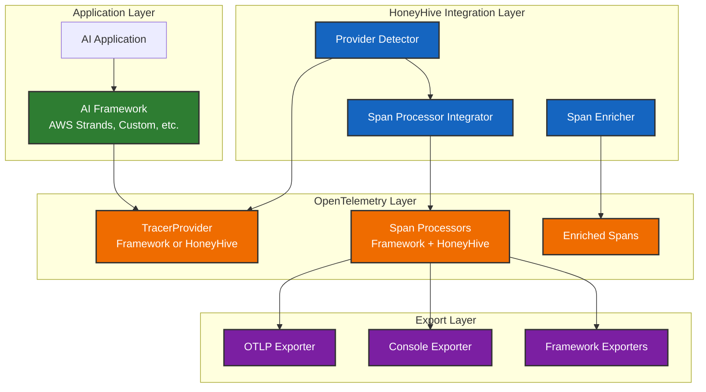

# Non-Instrumentor Integration Framework - Technical Specifications

**Date**: 2025-09-05  
**Status**: Draft  
**Priority**: High  

## Problem Statement

Many modern AI frameworks and platforms (like AWS Strands, custom enterprise solutions, and emerging AI orchestration tools) implement their own OpenTelemetry integration directly rather than using instrumentor libraries. These systems:

1. **Set up their own TracerProvider** - Often before HoneyHive initialization
2. **Create spans using raw OpenTelemetry APIs** - Not through instrumentor patterns
3. **Manage their own span processors** - For internal telemetry needs
4. **Use custom span attributes** - Framework-specific metadata schemas

Current HoneyHive integration patterns assume instrumentor-based workflows, creating integration challenges for frameworks that use OpenTelemetry machinery directly.

## Solution Framework

### Architecture Overview



### Core Components

#### REQ-NOI-001: Provider Detection System
**Requirement**: Automatically detect and classify existing OpenTelemetry TracerProviders

**Implementation Components**:
- **COMP-PD-001**: Provider Type Classifier
  - Detect NoOpTracerProvider (no existing setup)
  - Detect TracerProvider (standard SDK setup)
  - Detect ProxyTracerProvider (framework-managed setup)
  - Detect custom provider implementations

- **COMP-PD-002**: Integration Strategy Selector
  - Main Provider Strategy: HoneyHive becomes global provider
  - Secondary Provider Strategy: HoneyHive adds processors to existing provider
  - Fallback Strategy: Console logging when integration impossible

#### REQ-NOI-002: Span Processor Integration
**Requirement**: Add HoneyHive span processors to existing providers without disruption

**Implementation Components**:
- **COMP-SP-001**: Processor Compatibility Checker
  - Verify provider supports `add_span_processor()`
  - Check for processor ordering requirements
  - Validate processor chain integrity

- **COMP-SP-002**: HoneyHive Span Processor
  - Enrich spans with HoneyHive context (session_id, project, source)
  - Preserve existing span attributes and metadata
  - Handle span lifecycle events (start, end, error)

#### REQ-NOI-003: Initialization Order Independence
**Requirement**: Work correctly regardless of HoneyHive vs framework initialization order

**Implementation Components**:
- **COMP-IO-001**: Deferred Integration System
  - Queue integration actions when provider not ready
  - Execute integration when provider becomes available
  - Handle race conditions in multi-threaded environments

- **COMP-IO-002**: Provider State Monitor
  - Monitor global TracerProvider changes
  - Detect when frameworks set new providers
  - Trigger re-integration when necessary

### Integration Patterns

#### Pattern 1: HoneyHive First (Main Provider)
```python
# HoneyHive initializes first and becomes main provider
tracer = HoneyHiveTracer.init(api_key="...", project="...")
# Creates new TracerProvider, sets as global

# Framework uses existing global provider
framework = AIFramework()  # Uses HoneyHive's TracerProvider
result = framework.execute("task")  # Automatically traced
```

**Flow**:
1. HoneyHive creates TracerProvider
2. HoneyHive sets global TracerProvider
3. Framework discovers existing provider
4. Framework uses HoneyHive's provider
5. All spans automatically enriched

#### Pattern 2: Framework First (Secondary Provider)
```python
# Framework initializes first and sets up provider
framework = AIFramework()  # Creates and sets TracerProvider

# HoneyHive detects existing provider and integrates
tracer = HoneyHiveTracer.init(api_key="...", project="...")
# Adds span processor to existing provider

result = framework.execute("task")  # Spans enriched by HoneyHive processor
```

**Flow**:
1. Framework creates TracerProvider
2. Framework sets global TracerProvider
3. HoneyHive detects existing provider
4. HoneyHive adds span processor to existing provider
5. Framework spans enriched with HoneyHive context

#### Pattern 3: Multi-Framework Integration
```python
# Single HoneyHive tracer with multiple frameworks
tracer = HoneyHiveTracer.init(api_key="...", project="...")

# Multiple frameworks all use unified tracing
strands_agent = StrandsAgent(model="claude-3")
custom_pipeline = CustomPipeline(config="prod")
langchain_chain = LangChainChain(llm="gpt-4")

# All frameworks traced in unified session
research = strands_agent("Research topic")
analysis = custom_pipeline.analyze(research)
summary = langchain_chain.summarize(analysis)
```

**Flow**:
1. HoneyHive establishes unified tracing context
2. Each framework integrates with existing provider
3. All operations traced in single session
4. Unified observability across frameworks

### Technical Implementation

#### Provider Detection Algorithm
```python
def detect_provider_integration_strategy() -> IntegrationStrategy:
    """Detect existing provider and determine integration strategy."""
    existing_provider = trace.get_tracer_provider()
    
    # Check for NoOp provider (no existing setup)
    if is_noop_provider(existing_provider):
        return IntegrationStrategy.MAIN_PROVIDER
    
    # Check if provider supports span processors
    if hasattr(existing_provider, 'add_span_processor'):
        return IntegrationStrategy.SECONDARY_PROVIDER
    
    # Fallback for incompatible providers
    return IntegrationStrategy.CONSOLE_FALLBACK

def is_noop_provider(provider) -> bool:
    """Check if provider is NoOp or equivalent."""
    return (
        provider is None
        or "NoOp" in type(provider).__name__
        or str(type(provider).__name__) == "NoOpTracerProvider"
    )
```

#### Span Processor Integration
```python
class HoneyHiveSpanProcessor(SpanProcessor):
    """Span processor for enriching spans with HoneyHive context."""
    
    def on_start(self, span: Span, parent_context: Optional[Context] = None) -> None:
        """Enrich span on start with HoneyHive context."""
        # Add HoneyHive session context
        if session_id := self._get_session_id():
            span.set_attribute("honeyhive.session_id", session_id)
        
        # Add project and source context
        span.set_attribute("honeyhive.project", self.project)
        span.set_attribute("honeyhive.source", self.source)
        
        # Preserve framework-specific attributes
        self._preserve_framework_context(span, parent_context)
    
    def on_end(self, span: ReadableSpan) -> None:
        """Process span on end for additional enrichment."""
        # Add span duration and status
        if span.end_time and span.start_time:
            duration_ms = (span.end_time - span.start_time) / 1_000_000
            span.set_attribute("honeyhive.duration_ms", duration_ms)
```

#### Integration Validation
```python
def validate_integration() -> IntegrationStatus:
    """Validate that HoneyHive integration is working correctly."""
    provider = trace.get_tracer_provider()
    
    # Check provider type
    provider_type = type(provider).__name__
    
    # Check for HoneyHive span processors
    honeyhive_processors = []
    if hasattr(provider, '_span_processors'):
        for processor in provider._span_processors:
            if isinstance(processor, HoneyHiveSpanProcessor):
                honeyhive_processors.append(processor)
    
    return IntegrationStatus(
        provider_type=provider_type,
        honeyhive_processors_count=len(honeyhive_processors),
        integration_successful=len(honeyhive_processors) > 0
    )
```

## Requirements

### REQ-NOI-004: Performance Requirements
- **Span Processing Overhead**: <1ms per span for HoneyHive enrichment
- **Memory Overhead**: <5% increase in memory usage
- **Provider Detection**: <10ms for provider detection and integration
- **Concurrent Access**: Thread-safe operation in multi-threaded environments

### REQ-NOI-005: Compatibility Requirements
- **OpenTelemetry Versions**: Support OpenTelemetry SDK 1.20+
- **Python Versions**: Support Python 3.11, 3.12, 3.13
- **Framework Compatibility**: Work with any framework using OpenTelemetry directly
- **Provider Types**: Support TracerProvider, ProxyTracerProvider, custom implementations

### REQ-NOI-006: Error Handling Requirements
- **Graceful Degradation**: Framework functionality preserved if HoneyHive integration fails
- **Error Logging**: Clear error messages for integration failures
- **Fallback Modes**: Console logging when full integration impossible
- **Recovery**: Automatic retry of integration after transient failures

## Implementation Components

### COMP-NOI-001: Enhanced Provider Detection
**Purpose**: Robust detection of existing OpenTelemetry providers
**Location**: `src/honeyhive/tracer/provider_detector.py`
**Dependencies**: OpenTelemetry SDK, typing

### COMP-NOI-002: Span Processor Framework
**Purpose**: Flexible system for adding HoneyHive processors to any provider
**Location**: `src/honeyhive/tracer/processor_integrator.py`
**Dependencies**: OpenTelemetry SDK, HoneyHiveSpanProcessor

### COMP-NOI-003: Integration Strategy Manager
**Purpose**: Manage different integration strategies based on provider type
**Location**: `src/honeyhive/tracer/integration_manager.py`
**Dependencies**: Provider Detector, Span Processor Framework

### COMP-NOI-004: Validation Framework
**Purpose**: Runtime validation of integration correctness
**Location**: `src/honeyhive/tracer/integration_validator.py`
**Dependencies**: OpenTelemetry SDK, Integration Manager

## Validation Protocol

### Unit Testing
- **Provider Detection Tests**: Verify correct detection of all provider types
- **Span Processor Tests**: Validate span enrichment functionality
- **Integration Strategy Tests**: Test all integration patterns
- **Error Handling Tests**: Verify graceful degradation

### Integration Testing
- **AWS Strands Integration**: Complete integration test suite
- **Multi-Framework Testing**: Test with multiple frameworks simultaneously
- **Initialization Order Testing**: All permutations of initialization sequences
- **Performance Testing**: Benchmark overhead and memory usage

### Production Validation
- **Real-World Testing**: Test with actual production workloads
- **Long-Term Stability**: Extended testing for memory leaks
- **Framework Compatibility**: Test with major AI frameworks
- **User Acceptance**: Validate with actual users and use cases

## Success Criteria

### Functional Success
- ✅ **AWS Strands Integration**: 100% success rate across all scenarios
- ✅ **Provider Detection**: Correctly identifies all provider types
- ✅ **Span Enrichment**: All framework spans contain HoneyHive context
- ✅ **Order Independence**: Works regardless of initialization sequence

### Performance Success
- ✅ **Processing Overhead**: <1ms per span
- ✅ **Memory Efficiency**: <5% memory increase
- ✅ **Integration Speed**: <10ms for provider detection
- ✅ **Concurrent Safety**: Thread-safe operation

### Quality Success
- ✅ **Error Resilience**: Graceful handling of all failure modes
- ✅ **Documentation Quality**: Complete integration guides
- ✅ **Test Coverage**: >95% code coverage
- ✅ **User Experience**: Single-line integration for most frameworks

## Quality Gates

### Development Gates
1. **Unit Tests**: 100% pass rate
2. **Integration Tests**: 100% pass rate across all scenarios
3. **Performance Tests**: Meet all performance requirements
4. **Code Coverage**: >95% coverage

### Release Gates
1. **AWS Strands Integration**: Complete and documented
2. **Multi-Framework Testing**: Validated with 3+ frameworks
3. **Production Testing**: Validated in production-like environments
4. **Documentation**: Complete user and developer guides

### Post-Release Gates
1. **User Adoption**: >90% successful integration rate
2. **Performance Monitoring**: Continuous monitoring of overhead
3. **Framework Compatibility**: Regular testing with framework updates
4. **Community Feedback**: Positive feedback from users and framework developers

---

**Next Steps**: Review implementation tasks in `tasks.md` for detailed development plan.
